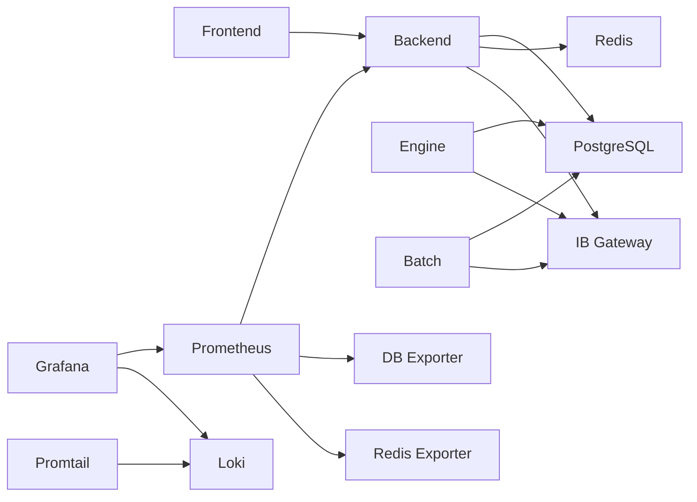

# 인프라 구성 정보

> 이 문서는 Trade System의 인프라 구성, 포트 매핑, 서비스 URL 및 프로젝트 구조를 포함합니다.

## 1. 포트 매핑

### 1.1 애플리케이션 서비스
| 서비스 | 컨테이너명 | 내부포트 | 외부포트 | 프로토콜 | 설명 |
|--------|------------|----------|----------|----------|------|
| Frontend | trade_frontend | 3000 | 3000 | HTTP | SvelteKit 웹 애플리케이션 |
| Backend API | trade_backend | 8000 | 8000 | HTTP/WS | FastAPI REST API 및 WebSocket |
| Trade Batch | trade_batch | 8080 | 8080 | HTTP | Spring Boot 배치 서비스 |
| Trade Engine | trade_engine | 8001 | 8001 | HTTP | Python 트레이딩 엔진 |
| Nginx | trade_nginx | 80, 443 | 80, 443 | HTTP/HTTPS | 리버스 프록시 |

### 1.2 데이터베이스 서비스
| 서비스 | 컨테이너명 | 내부포트 | 외부포트 | 설명 |
|--------|------------|----------|----------|------|
| PostgreSQL | trade_db | 5432 | 5432 | 관계형 데이터베이스 |
| Redis | trade_redis | 6379 | 6379 | 인메모리 캐시 |

### 1.3 모니터링 서비스
| 서비스 | 컨테이너명 | 내부포트 | 외부포트 | 설명 |
|--------|------------|----------|----------|------|
| Prometheus | trade_prometheus | 9090 | 9090 | 메트릭 수집 |
| Grafana | trade_grafana | 3000 | 3001 | 대시보드 (포트 변경됨) |
| Loki | trade_loki | 3100 | 3100 | 로그 저장소 |
| Promtail | trade_promtail | - | - | 로그 수집기 |

### 1.4 Exporter 서비스
| 서비스 | 컨테이너명 | 내부포트 | 외부포트 | 설명 |
|--------|------------|----------|----------|------|
| PostgreSQL Exporter | trade_postgres_exporter | 9187 | 9187 | DB 메트릭 |
| Redis Exporter | trade_redis_exporter | 9121 | 9121 | Redis 메트릭 |
| Node Exporter | trade_node_exporter | 9100 | 9100 | 시스템 메트릭 |

### 1.5 외부 서비스
| 서비스 | 호스트 | 포트 | 설명 |
|--------|--------|------|------|
| IB Gateway (Paper) | localhost | 4002 | 모의 거래 |
| IB Gateway (Live) | localhost | 4001 | 실거래 |
| IB TWS | localhost | 7497, 7496 | 트레이더 워크스테이션 |

## 2. 서비스 URL

### 2.1 개발 환경
- Frontend: http://localhost:3000
- Backend API: http://localhost:8000
- API 문서: http://localhost:8000/docs
- Grafana: http://localhost:3001
- Prometheus: http://localhost:9090
- Loki: http://localhost:3100 (Grafana로 접근)

### 2.2 운영 환경 (예정)
- Frontend: https://trade.example.com
- Backend API: https://api.trade.example.com
- Monitoring: https://monitor.trade.example.com

## 3. Docker 구성

### 3.1 Docker Compose 파일
| 파일명 | 용도 | 포함 서비스 |
|--------|------|-------------|
| docker-compose.yml | 개발 환경 | DB, Redis, Backend, Frontend |
| docker-compose.dev.yml | 개발 환경 (핫 리로드) | 개발용 볼륨 마운트 추가 |
| docker-compose.full.yml | 전체 스택 | 모든 서비스 + 모니터링 |
| docker-compose-core.yml | 핵심 서비스만 | DB, Redis만 |

### 3.2 Docker 네트워크
- 네트워크명: trade_network
- 드라이버: bridge
- 모든 컨테이너가 동일 네트워크 사용

### 3.3 Docker 볼륨
| 볼륨명 | 용도 | 경로 |
|--------|------|------|
| postgresql 데이터 | DB 영구 저장 | ./trade_infra/volumes/postgresql |
| redis 데이터 | 캐시 영구 저장 | ./trade_infra/volumes/redis |
| prometheus_data | 메트릭 저장 | Docker 볼륨 |
| grafana_data | 대시보드 설정 | Docker 볼륨 |
| loki_data | 로그 저장 | Docker 볼륨 |

## 4. 프로젝트 구조

```
trade/
├── .github/              # GitHub Actions CI/CD
│   └── workflows/
│       ├── ci.yml        # CI 파이프라인
│       └── cd.yml        # CD 파이프라인
├── common/               # 공통 리소스
│   ├── configs/          # 공통 설정
│   ├── scripts/          # 유틸리티 스크립트
│   └── templates/        # 프로젝트 템플릿
├── docs/                 # 프로젝트 문서
│   ├── ACCOUNTS_AND_ACCESS.md
│   ├── INFRASTRUCTURE.md (이 문서)
│   └── OPERATIONS.md
├── scripts/              # 자동화 스크립트
│   ├── backup.sh         # 백업 스크립트
│   ├── restore.sh        # 복원 스크립트
│   └── deploy.sh         # 배포 스크립트
├── trade_batch/          # Spring Boot 배치 서비스
├── trade_dashboard/      # FastAPI 백엔드
├── trade_engine/         # Python 트레이딩 엔진
├── trade_frontend/       # SvelteKit 프론트엔드
├── trade_infra/          # 인프라 설정
│   ├── configs/          # 서비스별 설정 파일
│   ├── docker/           # Docker 관련 파일
│   └── volumes/          # 데이터 볼륨
├── .env.development      # 개발 환경변수
├── .env.production       # 운영 환경변수
├── .env.example          # 환경변수 템플릿
└── README.md             # 프로젝트 소개
```

## 5. 서비스 의존성



## 6. 헬스체크 엔드포인트

| 서비스 | 헬스체크 URL | 응답 예시 |
|--------|--------------|----------|
| Backend API | http://localhost:8000/health | `{"status": "healthy"}` |
| Trade Batch | http://localhost:8080/actuator/health | Spring Boot Actuator |
| PostgreSQL | `pg_isready` 명령 | Docker 헬스체크 |
| Redis | `redis-cli ping` | `PONG` |

## 7. 리소스 요구사항

### 7.1 최소 요구사항 (개발)
- CPU: 2 cores
- RAM: 4GB
- Storage: 10GB

### 7.2 권장 요구사항 (운영)
- CPU: 4 cores
- RAM: 8GB
- Storage: 50GB SSD
- Network: 100Mbps

## 8. 보안 설정

### 8.1 방화벽 규칙
```bash
# 필수 포트만 열기
ufw allow 22/tcp   # SSH
ufw allow 80/tcp   # HTTP
ufw allow 443/tcp  # HTTPS
ufw allow 3000/tcp # Frontend (개발시)
ufw allow 8000/tcp # Backend API (개발시)
```

### 8.2 SSL/TLS
- Nginx에서 SSL 종료
- Let's Encrypt 인증서 사용 권장
- 인증서 경로: `/trade_infra/docker/proxy/nginx/ssl/`

## 9. 백업 및 복구

### 9.1 백업 대상
- PostgreSQL 데이터베이스
- Redis 스냅샷 (선택사항)
- 환경변수 파일
- Docker 볼륨

### 9.2 백업 스크립트
```bash
# 실행
./scripts/backup.sh

# 복구
./scripts/restore.sh backup_20240130.tar.gz
```

## 10. 확장 계획

### 10.1 수평 확장
- Backend: Docker Swarm 또는 K8s로 확장
- Database: PostgreSQL 읽기 복제본 추가
- Cache: Redis Cluster 구성

### 10.2 수직 확장
- 각 서비스별 리소스 제한 조정
- Docker Compose의 `deploy.resources` 설정 사용