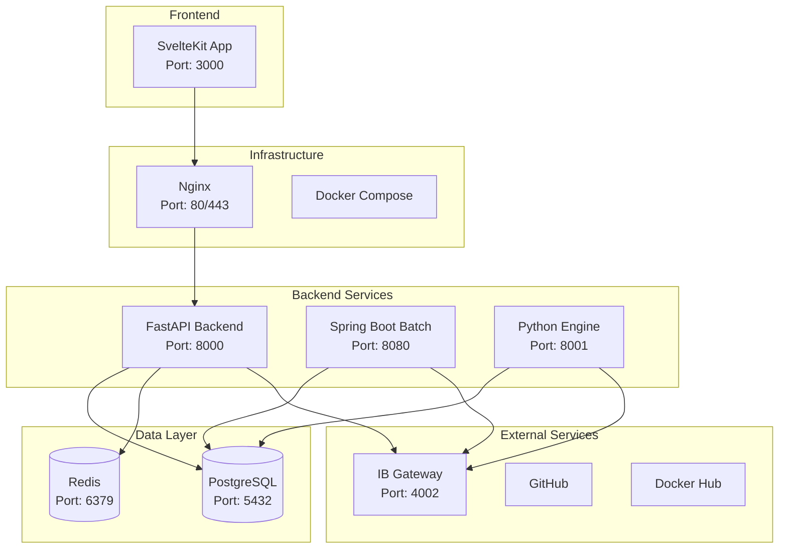
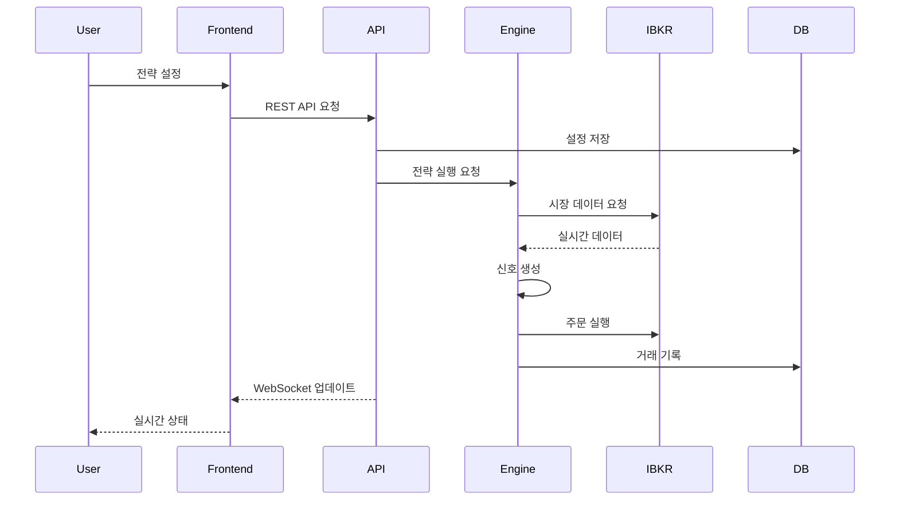
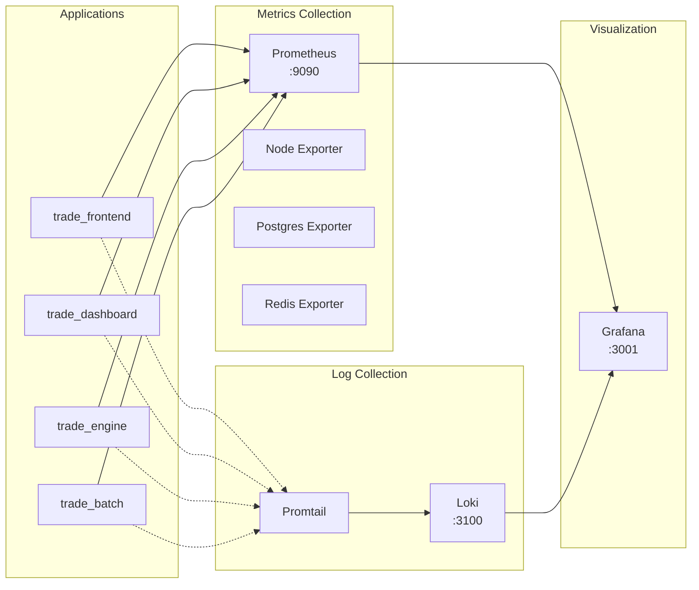
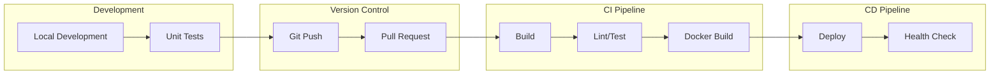

# Trade System - 프로젝트 구조 (PPT 자료)

> 이 문서는 PPT 제작을 위한 구조화된 내용입니다.

---

## 슬라이드 1: 프로젝트 개요

### 제목: Trade System - 개인 자동화 트레이딩 시스템

**핵심 특징:**
- 🎯 MSA(Microservice Architecture) 기반 설계
- 🤖 Interactive Brokers API 통합
- 📊 실시간 모니터링 및 분석
- 🔄 백테스트 및 라이브 트레이딩 지원
- 🔧 CI/CD 파이프라인 자동화

**프로젝트 목표:**
- 개인 투자자를 위한 전문가 수준의 트레이딩 시스템
- 유연하고 확장 가능한 아키텍처
- 운영 효율성 극대화

---

## 슬라이드 2: 시스템 아키텍처

### 제목: 전체 시스템 아키텍처



**주요 구성요소:**
- 프론트엔드: SvelteKit
- 백엔드: FastAPI, Spring Boot
- 데이터베이스: PostgreSQL, Redis
- 인프라: Docker, Nginx

---

## 슬라이드 3: 마이크로서비스 구성

### 제목: 4개의 핵심 마이크로서비스

| 서비스 | 언어/프레임워크 | 주요 기능 | 포트 |
|---------|----------------|-----------|------|
| **trade_frontend** | TypeScript/SvelteKit | 웹 UI, 실시간 차트 | 3000 |
| **trade_dashboard** | Python/FastAPI | REST API, WebSocket | 8000 |
| **trade_engine** | Python | 트레이딩 전략 실행 | 8001 |
| **trade_batch** | Java/Spring Boot | 배치 작업, 헬스체크 | 8080 |

**각 서비스의 역할:**
- 🖥️ Frontend: 사용자 인터페이스
- 🔗 Dashboard: API 게이트웨이
- ⚙️ Engine: 트레이딩 로직
- 🔄 Batch: 주기적 작업

---

## 슬라이드 4: 기술 스택

### 제목: 사용 기술 및 도구

**Frontend:**
- SvelteKit, TypeScript
- TailwindCSS
- Chart.js

**Backend:**
- Python: FastAPI, SQLAlchemy
- Java: Spring Boot, JPA
- WebSocket

**Database:**
- PostgreSQL 15
- Redis 7

**Infrastructure:**
- Docker & Docker Compose
- Nginx
- GitHub Actions (CI/CD)

**Monitoring:**
- Prometheus
- Grafana
- Loki & Promtail

**Trading:**
- Interactive Brokers API
- ib-insync
- vectorbtpro

---

## 슬라이드 5: 데이터 흐름도

### 제목: 데이터 흐름 및 통신



**주요 프로세스:**
1. 사용자 설정 → API → DB 저장
2. 엔진 → IBKR → 실시간 데이터
3. 신호 생성 → 주문 실행
4. WebSocket으로 실시간 업데이트

---

## 슬라이드 6: 배포 구조

### 제목: Docker Compose 기반 배포

**Docker Compose 파일 구성:**

```yaml
# docker-compose.yml (Production)
services:
  - PostgreSQL
  - Redis
  - Backend API
  - Frontend
  - Nginx
  - Portainer

# docker-compose.dev.yml (Development)
  + Hot reload volumes
  + Debug ports

# docker-compose.full.yml (Full Stack)
  + Prometheus
  + Grafana
  + Loki
  + Exporters
```

**배포 명령어:**
```bash
# 개발 환경
docker-compose -f docker-compose.dev.yml up -d

# 운영 환경
docker-compose up -d

# 전체 스택
docker-compose -f docker-compose.full.yml up -d
```

---

## 슬라이드 7: 모니터링 시스템

### 제목: PLG Stack 모니터링



**대시보드 구성:**
- System Overview
- Trade Metrics
- Application Logs
- Alert Rules

---

## 슬라이드 8: 개발 워크플로우

### 제목: CI/CD 파이프라인



**GitHub Actions 워크플로우:**
1. 코드 푸시 → 자동 빌드
2. 테스트 실행
3. Docker 이미지 빌드
4. 배포 (태그 시)

---

## 슬라이드 9: 프로젝트 구조

### 제목: 폴더 구조 및 주요 파일

```
trade/
├── .github/workflows/      # CI/CD 파이프라인
├── docs/                   # 프로젝트 문서
├── trade_batch/            # Java/Spring Boot
├── trade_dashboard/        # Python/FastAPI
├── trade_engine/           # Python 트레이딩 엔진
├── trade_frontend/         # SvelteKit
├── trade_infra/            # 인프라 설정
│   ├── configs/            # 환경 설정
│   ├── docker/             # Docker 관련
│   └── scripts/            # 운영 스크립트
└── README.md               # 프로젝트 소개
```

**핵심 파일:**
- `.env.example`: 환경변수 템플릿
- `docker-compose.yml`: 컨테이너 오케스트레이션
- `ci.yml`: CI 파이프라인
- `CLAUDE.md`: AI 가이드

---

## 슬라이드 10: 향후 계획

### 제목: 확장 및 개선 계획

**단기 계획:**
- ✅ ML 모델 통합 (TorchServe)
- ✅ 추가 전략 개발
- ✅ 백테스트 최적화

**중기 계획:**
- 🔄 Kubernetes 마이그레이션
- 🌐 멀티 브로커 지원
- 📊 고급 분석 기능

**장기 비전:**
- 🤝 커뮤니티 플랫폼
- 🤖 AI 기반 자동 최적화
- 🌍 글로벌 시장 지원

---

## 부록: 주요 명령어

### 개발 환경 시작
```bash
cd trade_infra/docker/compose
docker-compose -f docker-compose.dev.yml up -d
```

### 로그 확인
```bash
docker-compose logs -f [service_name]
```

### 테스트 실행
```bash
./trade_infra/docker/scripts/test-docker.sh
```

### 백업 실행
```bash
./trade_infra/scripts/backup.sh
```

---

## PPT 제작 팁

1. **디자인**: 깔끔하고 전문적인 템플릿 사용
2. **다이어그램**: Mermaid 코드를 이미지로 변환
3. **애니메이션**: 데이터 흐름에 화살표 애니메이션 추가
4. **색상**: 일관된 색상 테마 사용
5. **폰트**: 코드는 고정폭 폰트 사용